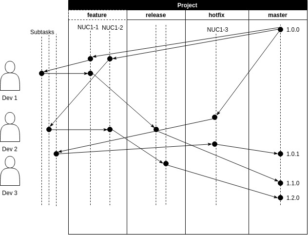

Plano de execução (branch model + CI)
===

Introdução
---

Este plano consiste basicamente em descrever o processo de CI/CD para o [Nucont](https://nucont.com/) utilizando o conceito de *branch model* em conjunto com o [Bitbucket](https://bitbucket.org).

Branch Model
---

O conceito de branch model é basicamente o de agrupar as branches conforme seu tipo (hotfix, release, feature, etc...). A forma como as branches vão ser utilizadas vão variar de organização e de sistema em si, já que se trata de uma metodologia e não de uma tecnologia em si.

**Feature**

Uma *Feature* é um tipo de branch que é desenvolvida normalmente, é utilizada quando será acrescentada uma nova funcionalidade ao sistema. No Jira, uma feature representa uma História que deve ser desenvolvida. Puxa-se a branch do card pai, e desenvolvemos e, quando finalizada, ela é mergida a uma branch *Release*.

**Hotfix**

Um *Hotfix* é uma correção de bug imediata, normalmente emergencial, que não depende do resto da equipe parar pra resolver, apenas um ou dois desenvolvedores fazem a correção para subir a correção sem depender do processo todo.

**Release**

Uma *Release* é uma branch que é criada para armazenar a versão antes de ir pra produção, é nela que os passos de QA devem ser executados onde o código que lá está, se aprovado, irá diretamente para os servidores. E disponibilizado para o cliente final.

O Processo
---

Calma, vamos entender o passo a passo de todo o processo.

É importante ressaltar que o código no servidor de PRODUÇÃO será sempre o mesmo da branch *origin/master* (OBS.: **SEMPRE!!!**).

O versionamento do Projeto se da pelas *tags*, onde cada nova versão na master **DEVE** ser taggeada com uma versão adicional.

- **Hotfix** -> X.X.(X+1)
- **Release** -> X.(X+1).0 OU (X+1).0.0

Outro ponto importante é que as branches de subtarefas são opcionais, porém auxilia o desenvolvedor a se organizar melhor. elas não possuem nenhum model.

**Feature -> Testes Automatizados**

Qualquer commit enviado para o bitbucket em uma branch do tipo *Feature* irá executar automaticamente os testes. Ou seja, nesse passo entra o CR, que irá verificar primeiro os pipelines desse branch model, se a branch em questão tiver algum teste quebrado, nem é necessário fazer o CR. Se aprovado, esse código irá para uma branch do tipo *Release*.

**Release -> STAGING**

Todo código enviado para alguma branch do tipo *Release* é enviada automaticamente para um servidor de STAGING, onde lá o processo de QA deve ser executado.

**master -> PRODUÇÃO**

Se o processo de QA for aprovado, essa branch do tipo *Release* ou do tipo *Hotfix* deve ser mergida na master e o processo de deploy para os servidores de produção irá ser executado.

**Hotfix -> PRODUÇÃO**

O único tipo de branch que pode burlar alguma parte do processo é o de *Hotfix*, que não necessariamente precisa passar por todo o processo de qualidade para ser enviado para produção. Normalmente são correções emergenciais que precisam de solução imediata.

# Authors

-   **Bruno Marra** \- DevOps Manager \- [brunonucont](https://github.com/brunonucont)

# Thanks for

-   **Team NuHackers**